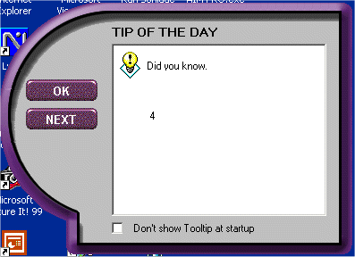

<div align="center">

## Cool Tip Of the Day Form \(Update\)


</div>

### Description

This code is a reupload of Kjell Ervik code! It includes everything that he had exept it is more like the real tip of the day form because it actually reads a text file!

Happy Codeing

(Please Vote For Me)
 
### More Info
 


<span>             |<span>
---                |---
**Submitted On**   |2000-12-06 22:07:44
**By**             |[RAM](https://github.com/Planet-Source-Code/PSCIndex/blob/master/ByAuthor/ram.md)
**Level**          |Intermediate
**User Rating**    |4.8 (67 globes from 14 users)
**Compatibility**  |VB 6\.0
**Category**       |[Miscellaneous](https://github.com/Planet-Source-Code/PSCIndex/blob/master/ByCategory/miscellaneous__1-1.md)
**World**          |[Visual Basic](https://github.com/Planet-Source-Code/PSCIndex/blob/master/ByWorld/visual-basic.md)
**Archive File**   |[CODE\_UPLOAD124111262000\.zip](https://github.com/Planet-Source-Code/ram-cool-tip-of-the-day-form-update__1-13389/archive/master.zip)

### API Declarations

```
If you like this then
vote for it
else
don't view my other submitions
end if
```


